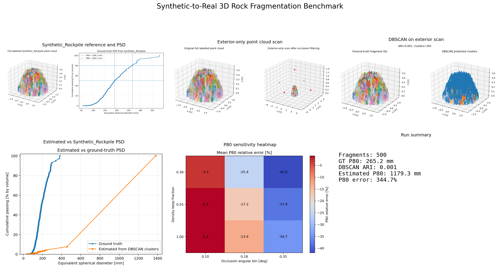
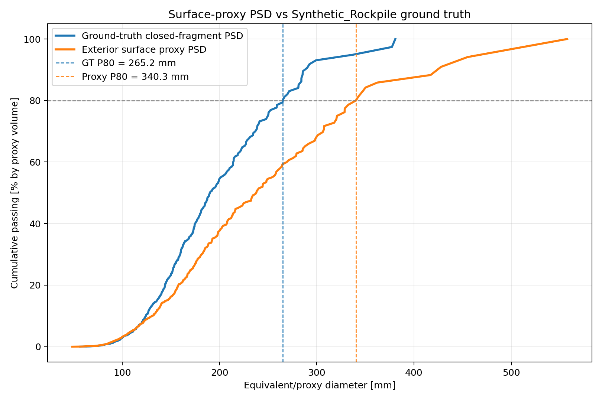

# Synthetic-to-Real 3D Rock Fragmentation

Research-oriented Python prototype for synthetic-to-real benchmarking of 3D rock fragmentation analysis from mesh-based rockpiles and exterior-only LiDAR-style point clouds.

This repository extends the earlier `physics-informed-synthetic-rockpile` project by reusing its generated synthetic rockpile as a known ground-truth reference. The benchmark removes interior/hidden point samples, keeps only exterior-visible scan points, segments the exterior scan, estimates PSD/P80, and compares those estimates against the original Synthetic_Rockpile PSD.

The project is deliberately modest in its first version: it is a synthetic benchmark and prototype workflow, not a field-validated fragmentation measurement system.

## Current Demo Output

The current notebook pipeline has been executed using this source reference pile:

`C:/Users/creep/code/python/Synthetic_Rockpile`



The original DBSCAN baseline shows why the benchmark is useful:

```text
Ground-truth fragments: 500
Ground-truth P80:       265.2 mm
Exterior scan points:   68,516
DBSCAN clusters:        392
DBSCAN ARI:             0.001
DBSCAN convex-hull P80: 1179.3 mm
P80 relative error:     344.7 %
```

A second, more research-oriented classical pipeline has now been added. It uses local surface normals, PCA curvature, graph region-growing, conservative height-marker splitting, and a surface-size proxy instead of convex hull volume:

```text
Surface graph clusters: 560
Surface graph NMI:      0.541
Surface graph ARI:      0.004
Surface proxy P80:      340.3 mm
P80 relative error:     28.3 %
```

This is not presented as solved instance segmentation. The low ARI and high noise fraction show that touching fragments in an exterior-only scan remain difficult. The improvement is that the new pipeline avoids the worst convex-hull failure mode and gives a more defensible classical baseline for future method development.



## Research Goal

The workflow is designed to study how well 3D point-cloud methods can recover rock fragmentation metrics when the ground truth is known.

Core tasks:

1. Load an existing synthetic rockpile and its recorded ground-truth PSD.
2. Reuse its ground-truth fragment IDs and fragment volumes.
3. Remove internal/hidden point samples so only exterior-visible scan points remain.
4. Apply scan degradation such as reduced point density, Gaussian noise, viewpoint limitation, and occlusion.
5. Segment individual fragments from point clouds.
6. Estimate fragment size distribution, PSD curves, and P10/P50/P80.
7. Compare estimated PSD against ground-truth PSD.
8. Analyse how scan resolution, noise, occlusion, and segmentation errors affect P80 estimation.

## Repository Layout

```text
synthetic-to-real-3d-rock-fragmentation/
|-- README.md
|-- requirements.txt
|-- environment.yml
|-- .gitignore
|-- notebooks/
|   |-- 01_generate_reference_rockpile.ipynb
|   |-- 02_virtual_lidar_scan.ipynb
|   |-- 03_pointcloud_segmentation_baseline.ipynb
|   |-- 03a_normal_curvature_features.ipynb
|   |-- 03b_graph_region_growing_segmentation.ipynb
|   |-- 03c_watershed_split_large_clusters.ipynb
|   |-- 04_psd_p80_estimation_from_pointcloud.ipynb
|   |-- 04_psd_p80_estimation_from_surface_proxy.ipynb
|   |-- 05_resolution_occlusion_sensitivity.ipynb
|   `-- 06_end_to_end_demo.ipynb
|-- src/
|   |-- io_utils/
|   |-- scanning/
|   |-- segmentation/
|   |   |-- dbscan_baseline.py
|   |   |-- surface_features.py
|   |   |-- graph_region_growing.py
|   |   `-- watershed_split.py
|   |-- fragmentation/
|   |   |-- psd.py
|   |   |-- p80.py
|   |   |-- surface_proxy.py
|   |   `-- volume_estimation.py
|   `-- visualisation/
|-- data/
|   |-- synthetic_meshes/
|   |-- reference_rockpiles/
|   |-- scanned_pointclouds/
|   `-- labels/
|-- outputs/
|   |-- figures/
|   |-- animations/
|   `-- tables/
`-- docs/
    |-- method_overview.md
    |-- dataset_card.md
    `-- limitations.md
```

## Installation

Conda is recommended because Open3D and trimesh are easier to manage in a clean environment.

```bash
conda env create -f environment.yml
conda activate synthetic-real-rockfrag
jupyter notebook
```

Pip-only setup:

```bash
python -m venv .venv
.venv\Scriptsctivate
pip install -r requirements.txt
```

## Notebook Pipeline

### 01_generate_reference_rockpile.ipynb

Load the previous `Synthetic_Rockpile` outputs as the reference dataset: fragment IDs, fragment volumes, equivalent spherical diameters, ground-truth PSD, and P10/P50/P80.

Main outputs:

- `data/scanned_pointclouds/synthetic_rockpile_full_labelled_pointcloud.npz`
- `data/labels/reference_fragments.csv`
- `outputs/tables/ground_truth_psd.csv`
- `outputs/tables/reference_source_summary.csv`
- `outputs/figures/reference_synthetic_rockpile_and_psd.png`

### 02_virtual_lidar_scan.ipynb

Convert the full labelled point cloud into an exterior-only scan. Interior/hidden points are removed by retaining points visible from exterior viewpoints using an angular-bin nearest-surface model.

Main outputs:

- `data/scanned_pointclouds/synthetic_rockpile_exterior_only_scan.npz`
- `data/scanned_pointclouds/synthetic_rockpile_exterior_only_scan.ply`
- `outputs/tables/exterior_scan_summary.csv`
- `outputs/figures/synthetic_rockpile_exterior_scan_preview.png`

### 03_pointcloud_segmentation_baseline.ipynb

Run the transparent distance-only DBSCAN baseline. This is kept as a failure-aware baseline because XYZ-only density clustering cannot reliably separate touching fragments in an exterior-only muckpile scan.

Main outputs:

- `data/labels/synthetic_rockpile_exterior_dbscan_segmentation.npz`
- `outputs/tables/segmentation_metrics.csv`
- `outputs/figures/synthetic_rockpile_exterior_dbscan_segmentation.png`

### 03a_normal_curvature_features.ipynb

Estimate local PCA normals and local curvature for every exterior scan point.

Main outputs:

- `data/scanned_pointclouds/synthetic_rockpile_exterior_surface_features.npz`
- `outputs/figures/surface_normal_curvature_features.png`

### 03b_graph_region_growing_segmentation.ipynb

Build a surface-compatibility graph. Points are connected only when they are spatial neighbours and have compatible normal direction, curvature, and vertical continuity.

Main outputs:

- `data/labels/synthetic_rockpile_exterior_graph_segmentation.npz`
- `outputs/tables/graph_segmentation_metrics.csv`
- `outputs/figures/synthetic_rockpile_graph_region_growing.png`

### 03c_watershed_split_large_clusters.ipynb

Apply a conservative height-marker split to large graph components. This approximates a watershed-style split without adding a new dependency.

Main outputs:

- `data/labels/synthetic_rockpile_exterior_surface_segmentation.npz`
- `outputs/tables/surface_segmentation_metrics.csv`
- `outputs/figures/synthetic_rockpile_surface_segmentation_split.png`

### 04_psd_p80_estimation_from_pointcloud.ipynb

Estimate fragment sizes from DBSCAN clusters using convex hull volume. This notebook is retained as a baseline and as a warning: convex hull volume becomes unstable for partial exterior scans and merged clusters.

Main outputs:

- `outputs/tables/estimated_cluster_volumes.csv`
- `outputs/tables/estimated_psd_dbscan.csv`
- `outputs/tables/p80_comparison.csv`
- `outputs/figures/synthetic_rockpile_estimated_vs_ground_truth_psd.png`

### 04_psd_p80_estimation_from_surface_proxy.ipynb

Estimate PSD/P80 using robust exterior surface-size proxies. The proxy volume is computed from the proxy diameter as `pi/6 * d^3`, so it is a benchmark estimator rather than a physical closed-mesh volume measurement.

Main outputs:

- `outputs/tables/surface_proxy_cluster_sizes.csv`
- `outputs/tables/estimated_psd_surface_proxy.csv`
- `outputs/tables/surface_proxy_p80_comparison.csv`
- `outputs/figures/surface_proxy_psd_vs_ground_truth.png`

### 05_resolution_occlusion_sensitivity.ipynb

Run controlled scan-degradation experiments. This notebook uses true labels after scan degradation to isolate the effect of scan density, noise level, viewpoint count, and occlusion severity on P80.

Main outputs:

- `outputs/tables/p80_error_sensitivity.csv`
- `outputs/figures/p80_sensitivity_heatmap.png`

### 06_end_to_end_demo.ipynb

Run a compact demonstration of the full synthetic-to-real benchmark on one scene.

Main outputs:

- `outputs/tables/end_to_end_run_summary.csv`
- `outputs/figures/end_to_end_benchmark_summary.png`

## First-Version Scope

Included:

- Python, NumPy, pandas, matplotlib, SciPy, scikit-learn, Open3D, trimesh
- Synthetic_Rockpile ground-truth import
- exterior-only virtual LiDAR-style scan filtering
- Gaussian noise and density degradation
- angular occlusion filtering
- DBSCAN baseline segmentation
- surface normal and curvature feature extraction
- graph region-growing segmentation
- height-marker splitting for large merged patches
- PSD and P80 comparison against ground truth
- explicit failure diagnostics for segmentation-driven PSD bias

Not included yet:

- deep learning segmentation
- field-calibrated LiDAR sensor modelling
- validated rock mechanics or blast fragmentation physics
- field-validated PSD estimation claims
- calibrated conversion from visible surface size to true fragment volume

## Research Positioning

This repository is intended as a controlled benchmark environment. Because synthetic fragment IDs and volumes are known, it can be used to quantify error sources that are difficult to isolate in field data:

- scan density loss
- viewpoint limitation
- occlusion
- range noise
- under-segmentation and over-segmentation
- size proxy bias
- P80 sensitivity

The goal is not to claim that synthetic data alone solves field fragmentation measurement. The goal is to build a transparent prototype where algorithmic assumptions can be tested before moving toward real LiDAR scans and calibrated site data.

## Generated Outputs

- `outputs/figures/reference_synthetic_rockpile_and_psd.png`
- `outputs/figures/synthetic_rockpile_exterior_scan_preview.png`
- `outputs/figures/synthetic_rockpile_exterior_dbscan_segmentation.png`
- `outputs/figures/synthetic_rockpile_estimated_vs_ground_truth_psd.png`
- `outputs/figures/surface_normal_curvature_features.png`
- `outputs/figures/synthetic_rockpile_graph_region_growing.png`
- `outputs/figures/synthetic_rockpile_surface_segmentation_split.png`
- `outputs/figures/surface_proxy_psd_vs_ground_truth.png`
- `outputs/figures/p80_sensitivity_heatmap.png`
- `outputs/figures/end_to_end_benchmark_summary.png`
- `outputs/tables/segmentation_metrics.csv`
- `outputs/tables/graph_segmentation_metrics.csv`
- `outputs/tables/surface_segmentation_metrics.csv`
- `outputs/tables/p80_comparison.csv`
- `outputs/tables/surface_proxy_p80_comparison.csv`
- `outputs/tables/p80_error_sensitivity.csv`
- `outputs/tables/end_to_end_run_summary.csv`

Diagnostic tuning tables generated during this run:

- `outputs/tables/surface_graph_parameter_sweep.csv`
- `outputs/tables/surface_split_parameter_sweep.csv`

## Interpretation Notes

The DBSCAN baseline does not recover the ground-truth fragments from exterior-only scan geometry. It predicts 392 clusters for 500 true fragments, but the adjusted Rand index remains very low because many clusters are spatially merged or fragmented in ways that do not match the true instance IDs. The convex-hull PSD estimate is therefore strongly biased.

The surface-geometry pipeline improves the PSD estimate, but it still does not solve instance segmentation. The current graph-based method predicts 560 surface clusters for 500 true fragments, with NMI around 0.54 but ARI around 0.004. That means the method captures some fragment-scale structure but still makes many point-level assignment errors.

Notebook `05` uses true fragment labels after scan degradation to isolate the effect of scan density, noise, and occlusion on P80. Notebook `03`, `03a`, `03b`, `03c`, `04`, and `04_surface_proxy` separately measure segmentation-driven error. This distinction is important: scan degradation, segmentation failure, and size-proxy bias are different error sources.
