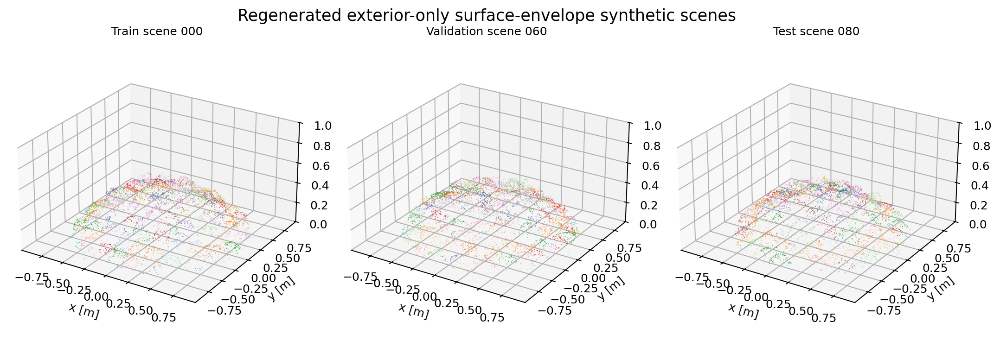
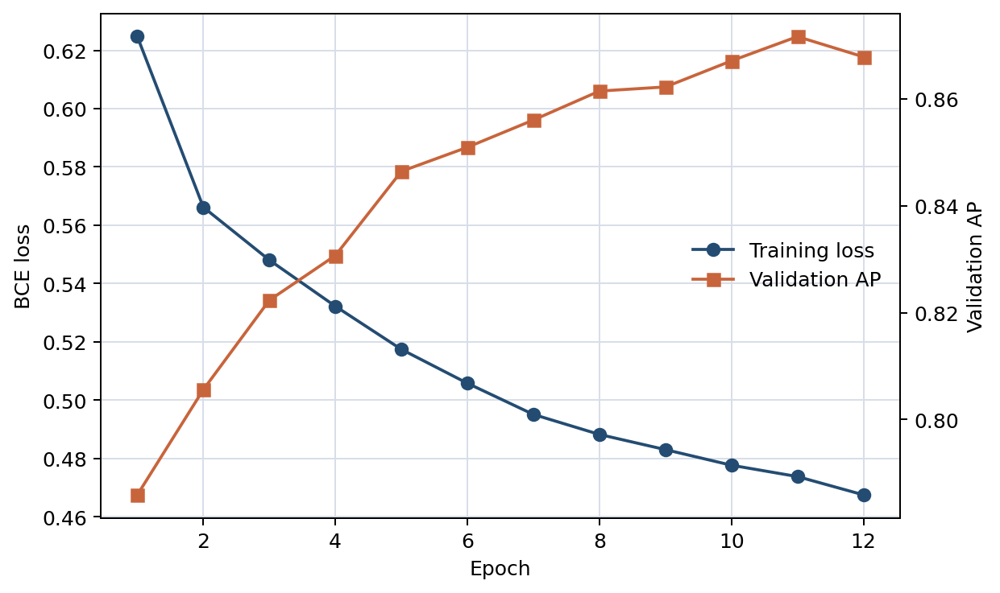
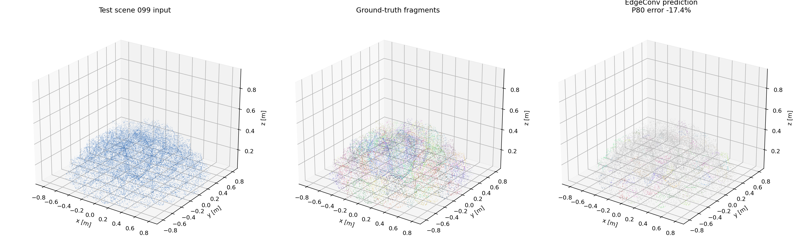
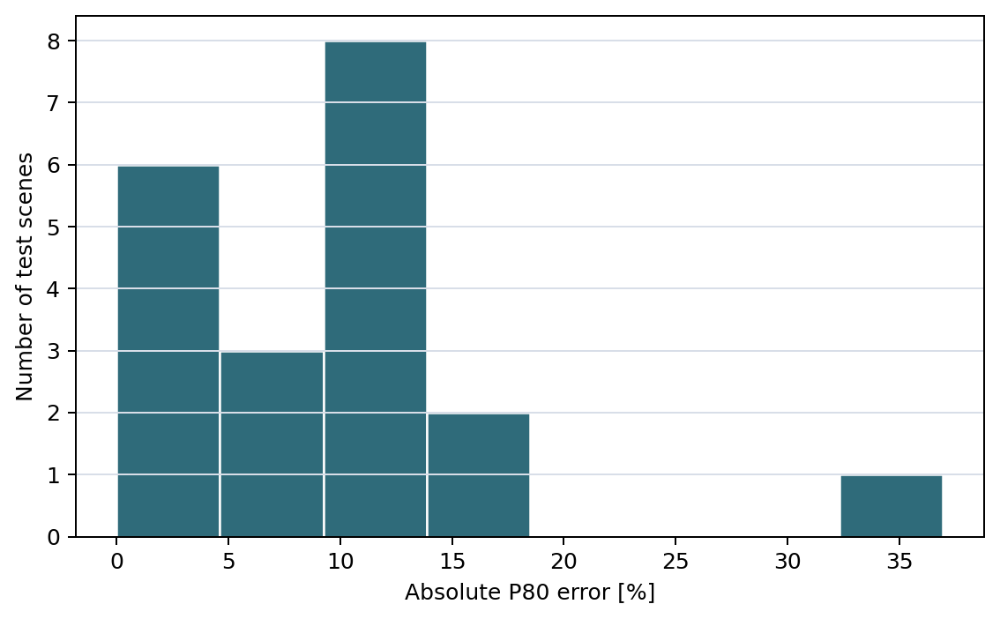
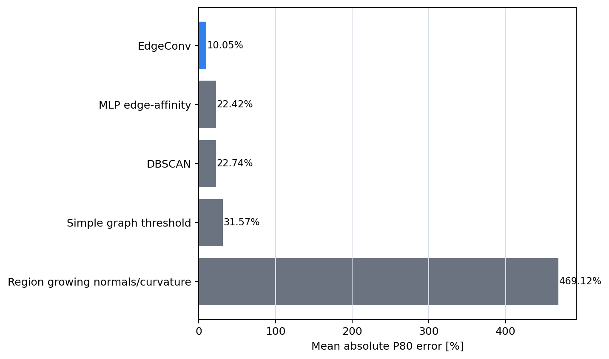

# DGCNN EdgeConv Rockpile PSD

Notebook-first DGCNN/EdgeConv benchmark for exterior-only rockpile point-cloud surface clustering and PSD/P80 estimation.

This repository is separate from previous work. It reuses the 100 Synthetic_Rockpile-style pile scenes generated in:

`C:/Users/creep/code/python/dnn-rockpile-affinity-psd`

Those scenes were generated from `Synthetic_Rockpile/01_fragment_generation.ipynb` fragment meshes and the cone/drop placement logic mirrored from `02_synthetic_pile_generation.ipynb`.

## Workflow

```text
100 pile scenes
60 train scenes
20 validation scenes
20 held-out test scenes
DGCNN/EdgeConv edge-affinity model
validation-selected edge threshold
test PSD/P80 evaluation
```

The model predicts whether neighbouring exterior-scan points belong to the same fragment. Connected components of high-affinity edges are treated as surface-cluster proxies, then PSD/P80 is estimated from surface-size proxies. They should not be read as clean fragment instances.

Training now applies photogrammetry-realism augmentation by default
(`--photogrammetry-realism 0.75`). The augmentation perturbs point positions,
normals, curvature, and edge geometry to mimic Structure-from-Motion/Multi-View
Stereo effects such as nonuniform density, edge softening, reconstruction noise,
and low-confidence sparse patches. Set `--photogrammetry-realism 0` to reproduce
the clean synthetic-only training condition.

## Current Result

The EdgeConv model was retrained for 12 epochs on the 60 training scenes with photogrammetry-realism augmentation and evaluated on regenerated exterior surface-envelope scenes.

Training trend:

```text
Epoch 1:  val AP 0.786, ROC-AUC 0.765
Epoch 6:  val AP 0.851, ROC-AUC 0.832
Epoch 12: val AP 0.868, ROC-AUC 0.851
```

Validation selected edge threshold:

```text
threshold = 0.77
variant   = raw EdgeConv surface clusters
```

Held-out test P80 comparison across 20 test piles:

```text
Method                         Mean abs P80 error   Median abs error   Max abs error
EdgeConv surface clusters        10.05 %             10.12 %           34.95 %
MLP edge affinity                22.42 %             19.16 %           52.46 %
DBSCAN                           22.74 %             25.49 %           40.48 %
Simple graph threshold           31.57 %             33.94 %           45.44 %
Region growing normals/curv.    469.12 %            459.01 %          618.88 %
```

The 12-epoch EdgeConv model gives the lowest held-out synthetic P80 error among the tested methods. The selected operating point is P80-oriented and is not an instance-segmentation optimum.

Important caveat: instance segmentation is still not solved. The selected EdgeConv result has mean NMI = 0.676, mean ARI = 0.0399, and mean noise fraction = 0.402 on the 20 held-out synthetic test scenes. This is a surface-cluster PSD/P80 benchmark result, not a clean fragment instance segmentation result.

Photogrammetry-realism augmentation ablation:

```text
Model      Augmentation   Mean abs P80 error   NMI     ARI      Noise fraction
EdgeConv   No             15.06 %              0.642   0.0272   0.454
EdgeConv   Yes            10.05 %              0.676   0.0399   0.402
```

The no-augmentation run was written under `outputs/runs/no_aug` using:

```powershell
python scripts/retrain_and_evaluate_edgeconv.py --photogrammetry-realism 0 --run-name no_aug --max-epochs 12
```

## Figures

Dataset examples:



Training curve:



Held-out test prediction example:



Held-out test P80 error histogram:



Surface-envelope baseline comparison:



## Notebooks

Run in order:

1. `notebooks/01_dataset_overview.ipynb`
2. `notebooks/02_train_dgcnn_edgeconv.ipynb`
3. `notebooks/03_validate_threshold_and_test_psd.ipynb`
4. `notebooks/04_compare_edgeconv_with_baselines.ipynb`

## Repository Layout

```text
dgcnn-edgeconv-rockpile-psd/
|-- README.md
|-- requirements.txt
|-- environment.yml
|-- notebooks/
|-- src/
|   |-- data/
|   |-- models/
|   |-- training/
|   |-- segmentation/
|   |-- fragmentation/
|   `-- visualisation/
`-- outputs/
    |-- figures/
    |-- models/
    `-- tables/
```

## Limitations

- The dataset is synthetic and inherits the assumptions of Synthetic_Rockpile's fragment and cone/drop pile generation.
- The model is trained on exterior-only synthetic scans, not field LiDAR scans.
- Threshold selection uses validation-set P80 error, so this is a benchmark-calibrated workflow.
- Independent field PSD references are required before operational field accuracy can be claimed.
- The current EdgeConv workflow improves held-out synthetic PSD/P80 but does not yet produce reliable fragment instance labels.
